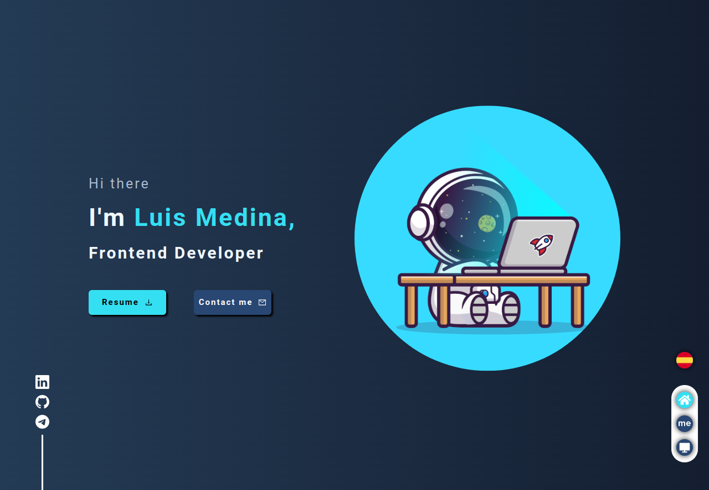

# Portfolio

This is my portfolio, design by me and inspired by some portfolios in LinkedIn like [Jimena](https://jimdiew.vercel.app/) and [Luis Grimaldi](https://luisgrimaldi-portfolio.vercel.app/)

## Overview

### Funcionality

Users should be able to:

- View the optimal layout for the app depending on their device's screen size
- See hover states for all interactive elements on the page
- Toggle language
- See my projects, and take a look of the repositories and pages of this projects

### Screenshot

### Links

- Live Site URL: [Luis Medina | Frontend Developer](https://portafolio-luis-medina.vercel.app/)

## My process

### Built with

- Semantic HTML5 markup
- CSS custom properties
- Flexbox
- CSS Grid
- Mobile-first workflow
- [React](https://reactjs.org/) - JS library
- [FormatJS](https://formatjs.io/)
- [React-Icons](https://react-icons.github.io/react-icons/)
- [React-Intersection-Observer](https://react-intersection-observer.vercel.app/)

## Author

- LinkedIn - [Luis Medina](https://www.linkedin.com/in/luis-medina-dev/)
